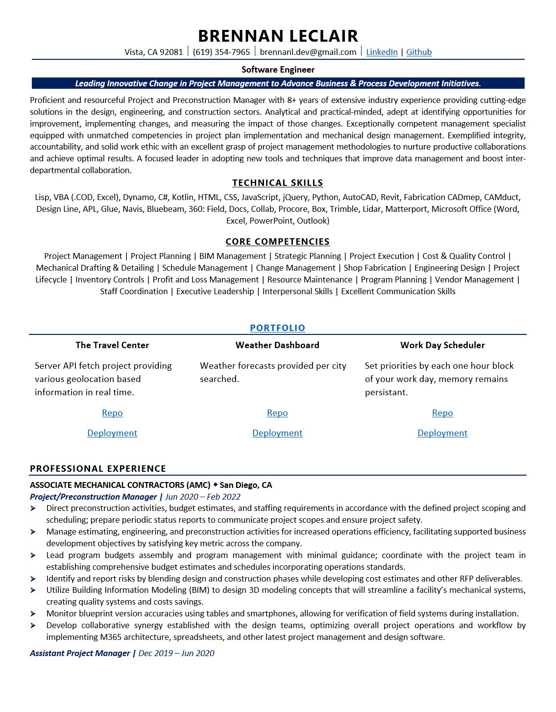

# Portfolio

Repository name: portfolio

## Description 

This portfolio and resume represent my experience to date.  You are welcome to contact me with any available opportunities.

## Technologies

Technologies used on this portfolio include:
* HTML
* 3rd Party API (Tailwind)

## Table of Contents (Optional)

* [Installation](#installation)
* [Usage](#usage)
* [Final Product](#finalproduct)

## Installation

No installation is required; simply visit: https://blec333.github.io/portfolio/ to review my deployed site.

## Usage 

Click the buttons to visit examples of my work.  My resume can be downloaded simply by clicking on the resume button.

Non-web based applications:

C#.NET:
* Requires installation of Autodesk AEC Suite including Fabrication CADmep software to evaluate functionality.  If able and so desired, please appload into Fabrication CADmep and test the provided custom commands.
* Written using .NET Framework 4.6.5

Python:
* Requires installation of Autodesk AEC Suite - Revit and Dynamo.  Load Python nodes into Dynamo.

Dynamo:
* Requires installation of Autodesk AEC Suite - Revit and Dynamo.  Load Dynamo script into Revit.

Lisp:
* Requires installation of Autodesk AEC Suite including Fabrication CADmep software to evaluate functionality.
* Provided resource files must be loaded into the default installation directory (replacing default files); this ensures data is properly exposed to the application for parsing and use in functions.

VBA & VB.NET:
* Requires installation of Autodesk AEC Suite including Fabrication CADmep software to evaluate functionality.

VBA:
* Requires only Excel to open and review.

## Final Product

Deployed Application
https://blec333.github.io/portfolio/

Github Repository
https://github.com/Blec333/portfolio

### License

MIT License

Copyright (c) 2022 Brennan LeClair

Permission is hereby granted, free of charge, to any person obtaining a copy
of this software and associated documentation files (the "Software"), to deal
in the Software without restriction, including without limitation the rights
to use, copy, modify, merge, publish, distribute, sublicense, and/or sell
copies of the Software, and to permit persons to whom the Software is
furnished to do so, subject to the following conditions:

The above copyright notice and this permission notice shall be included in all
copies or substantial portions of the Software.

THE SOFTWARE IS PROVIDED "AS IS", WITHOUT WARRANTY OF ANY KIND, EXPRESS OR
IMPLIED, INCLUDING BUT NOT LIMITED TO THE WARRANTIES OF MERCHANTABILITY,
FITNESS FOR A PARTICULAR PURPOSE AND NONINFRINGEMENT. IN NO EVENT SHALL THE
AUTHORS OR COPYRIGHT HOLDERS BE LIABLE FOR ANY CLAIM, DAMAGES OR OTHER
LIABILITY, WHETHER IN AN ACTION OF CONTRACT, TORT OR OTHERWISE, ARISING FROM,
OUT OF OR IN CONNECTION WITH THE SOFTWARE OR THE USE OR OTHER DEALINGS IN THE
SOFTWARE.

### Acknowledgements

©Brennan LeClair
